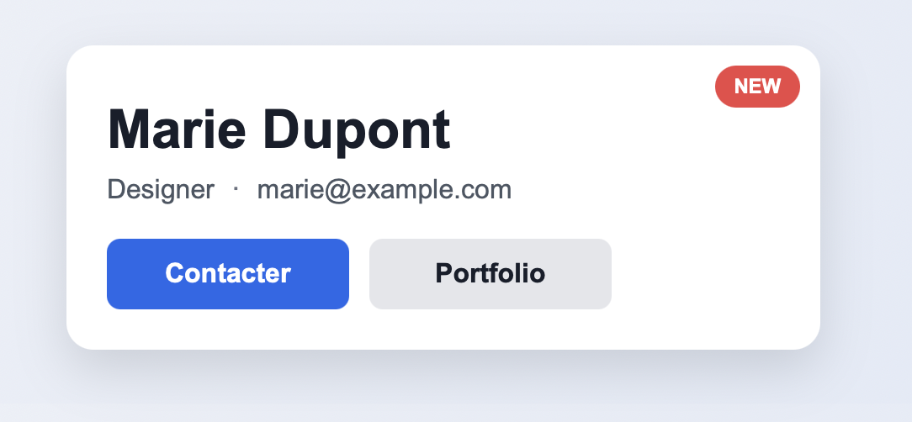
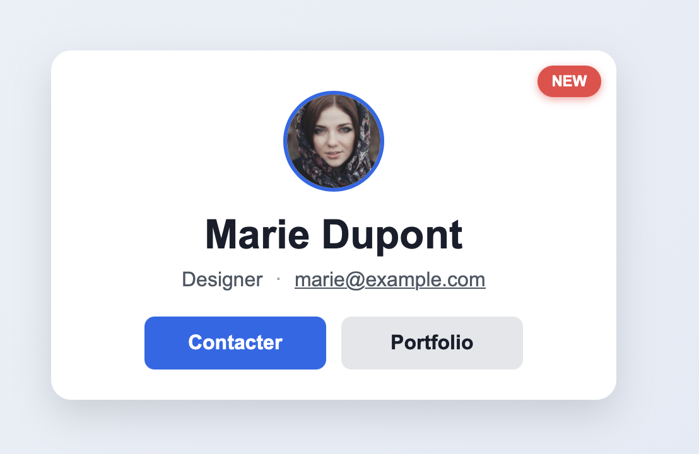

# TD2 — Box Model & Positionnement CSS

Pour chaque exercice, ouvrir le fichier HTML et CSS correspondant et compléter en suivant les instructions. Vous pouvez utiliser les outils de développement du navigateur pour inspecter les éléments et tester vos styles.

---

## Exo 00 — Utilisation des variables CSS

Dans plusieurs fichiers, vous trouverez déjà des variables comme `--bg`, `--text` ou `--border`. Les variables CSS permettent de stocker des valeurs réutilisables (couleurs, tailles, espacements, etc.) pour éviter de répéter les mêmes valeurs dans tout le code.

Exemple :

```css
:root {
  --primary: #2563eb;
  --text: #1f2937;
}

.card {
  color: var(--text);
  background: var(--primary);
}
```

L’intérêt est de centraliser les valeurs et de faciliter les changements globaux. Vous pouvez les utiliser dans les exercices pour garder un code plus lisible et plus cohérent.

> **Question :** pourquoi utiliser des variables CSS plutôt que de répéter les mêmes valeurs dans tout le code ?
> Dans le fichier `style.css` de l’exercice 00, utilisez les variables CSS pour définir les couleurs de fond et de texte des paragraphes. Si vous modifiez les variables dans `:root`, les changements se répercuteront automatiquement sur tous les éléments qui utilisent ces variables.

---

## Exercice 1 — Block, Inline et Inline-block

> `display: block`, `display: inline`, `display: inline-block`

À chaque élément, ajouter des propriétés CSS de :

- propriété display si nécessaire,
- taille,
- de marge externe,
- de marge interne.
- de couleur de fond,
- de bordure,

> **Question :** quelle est la différence entre les éléments **block**, **inline** et **inline-block** ?
> Observez les différences entre les éléments **block**, **inline** et **inline-block**.
> Dupliquez les éléments `.block` `.inline-block` et observez comment ils se comportent dans le flux du document.

---

## Exercice 2 — Content-box vs Border-box

> `box-sizing: content-box` · `box-sizing: border-box`

Appliquez aux deux boîtes les propriétés suivantes :

- une taille de 20rem (20 x 16px = 320px),
- une marge externe de 1rem,
- une marge interne de 0.5rem en haut et en bas et de 1rem à gauche et à droite,
- une bordure de 2px.

Appliquez `box-sizing: content-box` à la première et `box-sizing: border-box` à la seconde. Calculez la largeur réelle affichée de chacune.

> **Question :** quelle est la largeur réelle de chaque boîte ?

---

## Exercice 3 — Center des éléments

> `margin: 0 auto` · `text-align: center`

Ajouter les propriétés nécessaires pour centrer chaque élément dans son conteneur:

1. Élément de rendu **block** avec `margin: 0 auto`
2. Élément de rendu **inline** avec `text-align: center` sur le parent
3. Élément de rendu **inline-block** avec `text-align: center` sur le parent

> **Question :** quelles sont les différences entre ces trois méthodes de centrage ?
> Observez le comportement de chaque élément et comment ils sont centrés.
> Observez également la différence entre les éléments **inline** et **inline-block**.

---

## Exercice 4 — Position relative & absolute

`position: relative` · `position: absolute` · `top / right`

Créez un composant « image avec badge ». L'image reste dans le flux normal. Le badge « NEW » doit être positionné en **absolute** en haut à droite. Le conteneur doit être **relative** pour servir de référent. Modifiez les valeurs de `top` et `right` pour positionner le badge correctement.

Vous pouvez également changer le conteneur parent et observer comment le badge se positionne par rapport à ce nouveau parent.

> **Question :** quelle est la différence entre `relative` et `absolute` ? Comment positionner l'élément dont la position est `absolute` par rapport à son parent ?

---

## Exercice 5 — Position fixed vs sticky

> `position: fixed` · `position: sticky` · `top: 0` · `overflow: auto`

Créez une liste avec un en-tête qui reste fixe en haut du conteneur scrollable grâce à `position: fixed` et une « collé » en haut du conteneur scrollable grâce à `position: sticky`. Le conteneur a une hauteur fixe avec `overflow: auto`.

> **Question** : Quelles sont les différences entre `fixed` et `sticky` ? Comment positionner l'élément dont la position est`fixed`. Idem pour l'élément dont la position est `sticky` ?

---

## Exercice 6 — Synthèse : mise en page complète d'une carte de visite

> `display: block` · `display: inline` · `display: inline-block` · `position: relative` / `absolute`

Deux niveaux d'exercice sont proposés pour cette synthèse :

### Niveau 1 — Exercice 6 (`Exo06`) : Carte de visite de base

Réalisez une carte de visite simple en réinvestissant les notions vues dans les exercices précédents (display, box model, centrage, positionnement).



**Structure attendue dans Exo06 :**

- Un **nom** (`Marie Dupont`) en élément **block**, sur sa propre ligne
- Un **métier**, un **séparateur** `·` et un **email** en éléments **inline**, affichés à la suite sur la même ligne
- Deux **boutons** (« Contacter » et « Portfolio ») en **inline-block** pour accepter `width`/`padding`, alignés côte à côte
- Un **badge** « New » positionné en `absolute` en haut à droite de la carte (le conteneur `.card` doit être en `relative` pour servir de référent)

---

### Niveau 2 — Carte de visite guidée & complète

Allez plus loin en enrichissant la carte de visite avec une photo de profil et de bonnes pratiques web :



**Structure et améliorations dans Exo06plus :**

- Une **photo de profil** (``), centrée, avec des coins arrondis (`border-radius: 50%`)
  Utilisation d'un palceholder pour l'image : `https://i.pravatar.cc/150?img=47`

- Un **nom** (`Marie Dupont`) en élément **block**, sur sa propre ligne.
- Un **métier**, un **séparateur** et un **email** en vrai lien `mailto:`.
- Deux **boutons** (« Contacter » et « Portfolio ») avec gestion du survol (`:hover`).
- Un **badge** « New » positionné en `absolute` en haut à droite
- Utilisation de **variables CSS** dans `:root`.

---

**Consignes communes :**

1. Centrez la carte horizontalement dans la page.
2. Appliquez un fond blanc, des coins arrondis et une ombre portée à la carte.
3. Donnez un effet visuel au survol des boutons.
