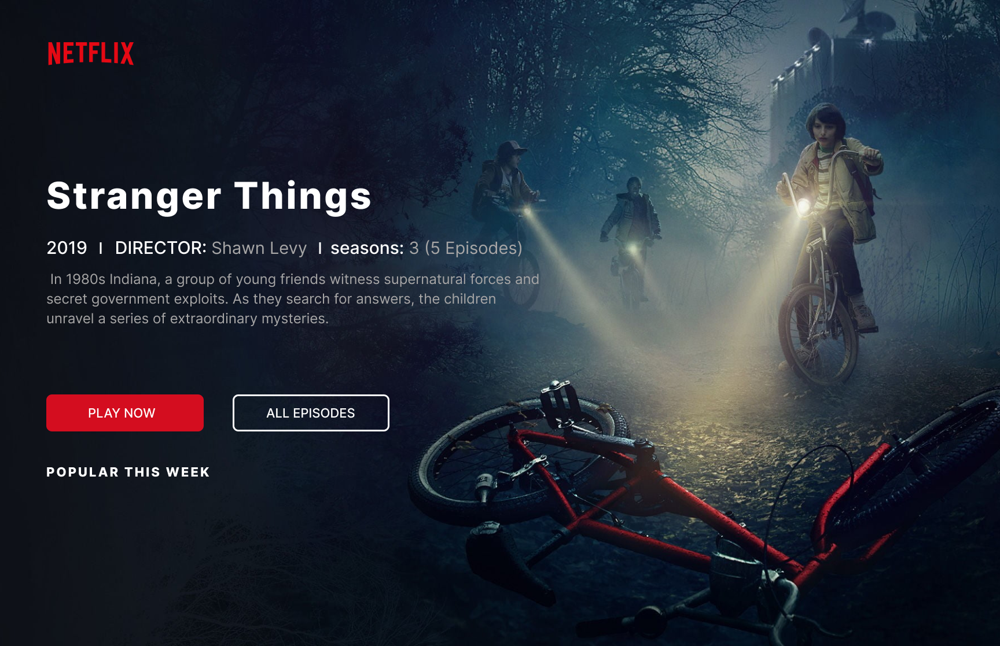

# TD 1 — Introduction au HTML & CSS

> **Objectifs :** Créer une première page web, la styliser avec CSS et découvrir les outils du développeur web.

**Projet fil rouge :** Reproduire cette page de présentation Netflix.



> **Assets fournis :**
>
> - `netflix.svg` — Le logo Netflix
> - `bg.png` — L'image de fond (affiche Stranger Things)

---

## Exercice 1 — Mise en place de l'environnement

### 1.1 Navigateur par défaut : Firefox

Configurer Firefox comme navigateur par défaut sous Windows :

1. Sélectionnez **Démarrer > Paramètres > Applications > Applications par défaut**.
2. Recherchez **Firefox** dans la liste.
3. Cliquez sur **Définir par défaut**.

> **Pourquoi Firefox ?** Firefox intègre des outils de développement très puissants (inspecteur d'élément, console, débogueur réseau…) que nous utiliserons tout au long de la formation.

---

### 1.2 Visual Studio Code

1. Créez un répertoire `TD1` sur le bureau.
2. Ouvrez **Visual Studio Code** et ouvrez votre dossier `TD1` (`Fichier > Ouvrir le dossier`).
3. Installez l'extension [**Live Server**](https://marketplace.visualstudio.com/items?itemName=ritwickdey.LiveServer) — elle recharge automatiquement le navigateur à chaque sauvegarde.
4. Installez l'extension [**Prettier**](https://marketplace.visualstudio.com/items?itemName=esbenp.prettier-vscode) — elle formate automatiquement votre code.

> [!TIP]
> **Raccourci utile :** `Ctrl + S` pour sauvegarder. Live Server détecte la sauvegarde et rafraîchit la page instantanément.

---

## Exercice 2 — Première page HTML

### 2.1 Structure des fichiers du projet

Organisez votre dossier `TD1` ainsi et copiez les assets fournis :

```plaintext
TD1/
├── assets/
│   ├ bg.png
│   └ netflix.svg
└── index.html
```

### 2.2 Structure minimale avec Emmet

**Emmet** est un plugin intégré à VS Code qui génère du code HTML/CSS à partir de raccourcis.

Dans votre fichier `index.html` vide, tapez **[`!`]** puis appuyez sur **[`Tab`]** :

```html
<!DOCTYPE html>
<html lang="en">
  <head>
    <meta charset="UTF-8" />
    <meta name="viewport" content="width=device-width, initial-scale=1.0" />
    <title>Document</title>
  </head>
  <body></body>
</html>
```

> **Explication des balises :**
>
> - `<!DOCTYPE html>` : déclare que le document est en HTML5.
> - `<html lang="en">` : balise racine de la page. Changez `en` en `fr` pour indiquer que la page est en français.
> - `<head>` : contient les métadonnées (non visibles par l'utilisateur).
> - `<meta charset="UTF-8">` : définit l'encodage de caractères (accents, emojis…).
> - `<body>` : contient tout le contenu visible de la page.

**À faire :** Modifiez l'attribut `lang` pour mettre `fr`, le `<title>` pour `Netflix — Stranger Things`, et ajoutez le lien vers le CSS :

```html
<!DOCTYPE html>
<html lang="fr">
  <head>
    <meta charset="UTF-8" />
    <meta name="viewport" content="width=device-width, initial-scale=1.0" />
    <title>Netflix — Stranger Things</title>
  </head>
  <body></body>
</html>
```

✅ **Validation :** Ouvrez la page avec Live Server → page blanche, l'onglet doit afficher "Netflix — Stranger Things" et console ne doit contenir aucune erreur.

> [!TIP]
> **Raccourci utile :** `Ctrl + Shift + I` pour ouvrir l'inspecteur d'élément dans Firefox.

### 2.3 Ajout de contenu

Dans le `<body>`, ajoutez les éléments suivants :

| Balise  | Rôle                                  | Exemple                                           |
| ------- | ------------------------------------- | ------------------------------------------------- |
| `<h1>`  | Titre de niveau 1 (le plus important) | `<h1>HELLO HTML</h1>`                             |
| `<p>`   | Paragraphe de texte                   | `<p>CSS is AWESOME</p>`                           |
| `<a>`   | ancre                                 | `<a href="https://www.netflix.com">Netflix</a>`   |
| `` | Image                                 | `` |

> **Attribut de `<a>` :**
>
> - `href` : lien vers une autre page ou un autre site (obligatoire)

> **Attributs de `` :**
>
> - `src` : chemin vers le fichier image (obligatoire)
> - `alt` : description textuelle de l'image (obligatoire pour l'accessibilité)
> - `width` : largeur en pixels — permet au navigateur de réserver l'espace avant que l'image soit chargée, évitant les "sauts" de mise en page

> **Hiérarchie des titres :** HTML propose 6 niveaux de titres (`<h1>` à `<h6>`). Il ne doit y avoir qu'un seul `<h1>` par page (le titre principal). Vous devez respecter la hiérarchie des titres : pas de h4 sans h3, pas de h3 sans h2, etc.

### 2.4 Application Netflix — Contenu du hero

- Supprimer le contenu du `<body>`, ajoutez le `<header>` et les éléments du hero (cf. image dessus).

- Faites un **clic droit** sur votre fichier `index.html` dans l'explorateur VS Code.
- Sélectionnez **"Open with Live Server"**.
- Votre page s'ouvre dans Firefox.
- Sur votre page ouverte dans Firefox, faites un **clic droit** sur un élément > **Inspecter l'élément**.
- Explorez le panneau **HTML** à gauche et le panneau **CSS** à droite.

> **À essayer :** Survolez les balises dans l'inspecteur — Firefox surligne l'élément correspondant dans la page.

✅ **Validation :** Rechargez la page — tout le texte brut et l'image s'affiche sans mise en forme.

<details>
<summary><b>Correction HTML</b></summary>

Voici le code HTML complet du hero

```html
<header>
  <!-- Logo Netflix -->
  

  <!-- Titre de la série -->
  <h1>Stranger Things</h1>

  <!-- Métadonnées -->
  <div>
    2019 &nbsp;|&nbsp; DIRECTOR: Shawn Levy &nbsp;|&nbsp; seasons: 3 &nbsp;(5
    Episodes)
  </div>

  <!-- Description -->
  <p>
    In 1980s Indiana, a group of young friends witness supernatural forces and
    secret government exploits. As they search for answers, the children unravel
    a series of extraordinary mysteries.
  </p>

  <!-- Boutons d'action -->
  <div>
    <a href="#">PLAY NOW</a>
    <a href="#">ALL EPISODES</a>
  </div>

  <!-- Footer du hero -->
  <p>POPULAR THIS WEEK</p>
</header>
```

</details>

---

## Exercice 3 — Mise en forme avec CSS

### 3.1 Création et liaison du fichier CSS

1. Créez un dossier `css/` dans votre répertoire `TD1`.
2. Dans ce dossier, créez un fichier `style.css`.

```plaintext
TD1/
├── assets/
│   ├ bg.png
│   └ netflix.svg
├── css/
│   └ style.css
└── index.html
```

3. **Liez** le fichier CSS à votre HTML en ajoutant dans le `<head>` :

```html
<link rel="stylesheet" href="css/style.css" />
```

> [!WARNING]
> **Principe de séparation des responsabilités :** le HTML structure le contenu, le CSS gère l'apparence. On ne les mélange pas.

### 3.2 Propriétés de base

Consultez [MDN Web Docs](https://developer.mozilla.org/fr/) pour chacune des propriétés suivantes et appliquez-les dans votre `style.css` :

| Propriété CSS                                                                        | Rôle                   |
| ------------------------------------------------------------------------------------ | ---------------------- |
| [`color`](https://developer.mozilla.org/fr/docs/Web/CSS/color)                       | Couleur du texte       |
| [`background-color`](https://developer.mozilla.org/fr/docs/Web/CSS/background-color) | Couleur d'arrière-plan |
| [`font-family`](https://developer.mozilla.org/fr/docs/Web/CSS/font-family)           | Police de caractères   |

**Exemple de règle CSS :**

```css
body {
  background-color: #2868a7;
  color: #a22323;
  font-family: Arial, Helvetica, sans-serif;
}
```

> [!NOTE]
> **Syntaxe d'une règle CSS :**
>
> ```
> sélecteur {
>   propriété: valeur;
> }
> ```
>
> Le **sélecteur** cible un ou plusieurs éléments HTML. La **propriété** est ce que l'on veut modifier. La **valeur** est ce qu'on lui attribue.

### 3.3 Application Netflix — Reset et styles de base

La **première chose** à écrire dans tout fichier CSS est le reset universel (couche **Generic**), qui supprime les marges et espaces par défaut des navigateurs :

```css
/* ============================================
   GENERIC — Micro Reset navigateur
   ============================================ */
* {
  /* Force le calcul de la taille d'un élément en incluant son padding et sa bordure */
  box-sizing: border-box;
  /* Supprime les marges externes */
  margin: 0;
  /* Supprime les marges internes */
  padding: 0;
}
```

> **`box-sizing: border-box`** : fait en sorte que le `padding` et la `border` soient inclus dans la largeur/hauteur d'un élément. Indispensable pour des mises en page prévisibles.

✅ **Vérification :** Les marges blanches autour de la page ont disparu.

Ajoutez ensuite les styles de base (couche **Elements**) :

```css
/* ============================================
   ELEMENTS — Styles des balises HTML de base
   ============================================ */
body {
  /* Police de caractère par défaut */
  font-family: sans-serif;
  /* Couleur du texte par défaut */
  color: white;
}

a,
a:visited {
  /* Couleur du texte blanc */
  color: white;
  /* Suppression du soulignement */
  text-decoration: none;
}
```

✅ **Vérification :** Tout le texte est maintenant en blanc.

- Appliquez une police **sans-serif** (ex : `Arial`, `Helvetica`, ou `sans-serif` en générique).

---

## Exercice 4 — Sélecteurs CSS : balises et classes

### 4.1 Le sélecteur de balise (déjà vu)

Cible tous les éléments d'un type donné, exemple : tous les `<p>` de la page.

```css
a {
  color: steelblue;
}
```

### 4.2 Le sélecteur de classe (`.`)

Une **classe** s'applique à un ou plusieurs éléments. Elle se déclare avec l'attribut `class` en HTML et se cible avec un `.` en CSS.

**HTML :**

```html
<div>
  <a class="important" href="#">PLAY NOW</a>
  <a href="#">ALL EPISODES</a>
</div>
```

**CSS :**

Ajouter à votre `style.css` :

```css
.important {
  color: crimson;
  font-weight: bold;
}
```

> **Avantage des classes :** une même classe peut être réutilisée sur autant d'éléments que nécessaire, quel que soit leur type de balise.

### 4.3 Nommer ses classes avec du sens

Une bonne classe décrit **ce qu'est** l'élément, pas **comment il ressemble**.

| ❌ À éviter   | ✅ À préférer    | Pourquoi                             |
| ------------- | ---------------- | ------------------------------------ |
| `.rouge`      | `.alerte`        | La couleur peut changer, le rôle non |
| `.gros-texte` | `.titre-section` | Décrit la fonction, pas l'apparence  |
| `.div1`       | `.carte-produit` | Lisible et réutilisable              |

**À faire :**

1. Dans votre HTML, ajouter des classes sémantiques à chaque élément du hero :

- `class="hero"`
- `class="hero-logo"`
- `class="hero-title"`
- `class="hero-meta"`
- `class="hero-description"`
- `class="hero-actions"`
- `class="hero-footer"`

2. Cas particulier pour les boutons : utilisez **multi-classes** pour combiner un style commun et un style spécifique :

- `class="btn btn--primary"` pour le bouton rouge
- `class="btn btn--outline"` pour le bouton transparent

<details>
<summary><b>Correction HTML et attributs `class`</b></summary>

Voici le code HTML complet du hero ainsi que les classes CSS correspondantes.

```html
<header class="hero">
  <!-- Logo Netflix -->
  

  <!-- Titre de la série -->
  <h1 class="hero-title">Stranger Things</h1>

  <!-- Métadonnées -->
  <div class="hero-meta">
    2019 &nbsp;|&nbsp; DIRECTOR: Shawn Levy &nbsp;|&nbsp; seasons: 3 &nbsp;(5
    Episodes)
  </div>

  <!-- Description -->
  <p class="hero-description">
    In 1980s Indiana, a group of young friends witness supernatural forces and
    secret government exploits. As they search for answers, the children unravel
    a series of extraordinary mysteries.
  </p>

  <!-- Boutons d'action -->
  <div class="hero-actions">
    <a href="#" class="btn btn-primary">PLAY NOW</a>
    <a href="#" class="btn btn-outline">ALL EPISODES</a>
  </div>

  <!-- Footer du hero -->
  <p class="hero-footer">POPULAR THIS WEEK</p>
</header>
```

> **Pourquoi `class` et pas `id` ?**
> Les classes permettent de réutiliser les styles. Un `id` est unique sur la page et ne doit jamais servir pour le CSS — uniquement pour les ancres (`<a href="#section">`) et le JavaScript.

</details>

### 4.4 Application Netflix — Composants CSS (couche Components)

Stylez maintenant chaque élément du hero avec ses classes sémantiques :

**Le bloc hero — image de fond plein écran :**

```css
/* ============================================
   COMPONENTS — Composants de l'interface
   ============================================ */

/* --- Hero (bloc principal) --- */
.hero {
  height: 100vh;
  padding: 3rem 5rem;
  /* Attention : le chemin de l'image est relatif au fichier CSS, pas au HTML*/
  background-image: url("../assets/bg.png");
  background-size: cover;
  background-position: center;
  background-repeat: no-repeat;
}
```

> **`height: 100vh`** : `vh` = _viewport height_. `100vh` = 100 % de la hauteur de la fenêtre du navigateur.
> **`background-size: cover`** : l'image remplit tout le bloc sans se déformer.

✅ **Vérification :** L'image de fond Stranger Things s'affiche plein écran.

**Le logo, le titre et les métadonnées :**

```css
/* --- Logo --- */
.hero-logo {
  /* Image de logo */
  width: 7.5rem; // 120px/16px = 7.5rem;
}

/* --- Titre --- */
.hero-title {
  /* Marges externes */
  margin: 8rem 0 1rem;
  /* Taille de la police */
  font-size: 4rem;
  /* Graisse de la police */
  font-weight: bold;
}

/* --- Métadonnées --- */
.hero-meta {
  /* Marges externes en bas */
  margin-bottom: 1rem;
  /* Taille de la police */
  font-size: 1rem;
  /* Graisse de la police */
  font-weight: 600;
  /* Espacement entre les lettres */
  letter-spacing: 0.05em;
  /* Opacité du texte */
  opacity: 0.9;
}
```

> **`rem`** est une unité relative à la taille de police de base du navigateur (généralement `16px`). `4rem` = `64px`. Préférez `rem` aux pixels fixes.

**La description :**

```css
/* --- Description --- */
.hero-description {
  /* Marges externes en bas */
  margin-bottom: 2.5rem;
  /* Largeur */
  width: 40%;
  /* Style de la police */
  font-weight: 300;
  /* Interlignage */
  line-height: 1.6;
  /* Opacité du texte */
  opacity: 0.75;
}
```

> **`width: 40%`** : limite la largeur du paragraphe. Un texte sur toute la largeur serait difficile à lire sur fond d'image.

**Les boutons — multi-classes :**

```css
/* --- Zone de boutons --- */
.hero-actions {
  /* Marges externes en bas */
  margin-bottom: 3rem;
  /* Positionement flexible*/
  display: flex;
  /* Gouttière */
  gap: 1rem;
}

/* Styles communs à tous les ancre style bouton */
.btn {
  font-weight: 700;
  /* Espacement entre les lettres */
  letter-spacing: 0.1em;
  /* Style de texte ici en majuscules */
  text-transform: uppercase;
  /* Bordure */
  border: 2px solid white;
  /* Curseur de la souris */
  cursor: pointer;
}

/* Bouton rouge plein */
.btn--primary {
  /* Couleur du texte */
  color: white;
  /* Couleur de fond */
  background-color: #e50914;
  /* Couleur de la bordure */
  border-color: #e50914;
}

/* Bouton transparent avec bordure */
.btn--outline {
  /* Couleur du texte */
  color: white;
  /* Couleur de fond */
  background-color: transparent;
}

.btn:hover {
  /* Opacité lors du survol */
  opacity: 0.7;
}
```

> **Multi-classes :** `class="btn btn-primary"` combine deux classes. `.btn` apporte les styles communs ; `.btn-primary` ajoute la couleur rouge.

✅ **Vérification :** Les boutons sont alignés horizontalement et possèdent des styles distincts selon leur rôle.

### 4.5 Récapitulatif des sélecteurs

| Sélecteur | Syntaxe HTML  | Syntaxe CSS | Utilisation                            |
| --------- | ------------- | ----------- | -------------------------------------- |
| Balise    | `<p>`         | `p { }`     | Cible **tous** les éléments `<p>`      |
| Classe    | `class="nom"` | `.nom { }`  | Cible plusieurs éléments réutilisables |

> **Bonne pratique :** Utilisez exclusivement des **classes** pour le style CSS. Les attributs `id` sont réservés aux ancres de navigation (`<a href="#section">`) et aux interactions JavaScript — **jamais** pour du style.

---

## Exercice 5 — Code complet & Bilan

### Code final — `index.html`

<details>
<summary>Afficher/masquer le code HTML</summary>

```html
<!DOCTYPE html>
<html lang="fr">
  <head>
    <meta charset="UTF-8" />
    <meta name="viewport" content="width=device-width, initial-scale=1.0" />
    <title>Netflix — Stranger Things</title>
    <link rel="stylesheet" href="css/style.css" />
  </head>
  <body>
    <header class="hero">
      
      <h1 class="hero-title">Stranger Things</h1>
      <div class="hero-meta">
        2019 &nbsp;|&nbsp; DIRECTOR: Shawn Levy &nbsp;|&nbsp; seasons: 3
        &nbsp;(5 Episodes)
      </div>
      <p class="hero-description">
        In 1980s Indiana, a group of young friends witness supernatural forces
        and secret government exploits. As they search for answers, the children
        unravel a series of extraordinary mysteries.
      </p>
      <div class="hero-actions">
        <button class="btn btn--primary">PLAY NOW</button>
        <button class="btn btn--outline">ALL EPISODES</button>
      </div>
      <p class="hero-footer">POPULAR THIS WEEK</p>
    </header>
  </body>
</html>
```

</details>

### Code final — `css/style.css`

<details>
<summary>Afficher/masquer le code CSS</summary>

```css
/* GENERIC */
/* Réinitialisation des styles par défaut - Micro Reset */
* {
  /* Le calcul de la taille inclut les bordures et le padding */
  box-sizing: border-box;
  /* Marges externes à 0 */
  margin: 0;
  /* Marges internes à 0 */
  padding: 0;
}

/* ELEMENTS- style pour tous les éléments HTML */
body {
  /* Famille de police sans-serif */
  font-family: sans-serif;
  /* Couleur du texte blanc */
  color: white;
}

a,
a:visited {
  /* Couleur du texte blanc */
  color: white;
  /* Suppression du soulignement */
  text-decoration: none;
}

/* COMPONENTS */
.hero {
  /* hauteur de 100% de la vue */
  height: 100vh;
  /* Marges internes (1rem = 16px) */
  padding: 3rem 5rem;
  /* Image de fond */
  background-image: url("../assets/bg.png");
  /* Ajustement de l'image de fond */
  background-size: cover;
  /* Position de l'image de fond */
  background-position: center;
  /* Répétition de l'image de fond */
  background-repeat: no-repeat;
}

.hero-title {
  /* Marges externes */
  margin: 8rem 0 1rem;
  /* Taille de la police */
  font-size: 4rem;
  /* Graisse de la police */
  font-weight: bold;
}

.hero-meta {
  /* Marges externes basse */
  margin-bottom: 1rem;
  /* Taille de la police */
  font-size: 1rem;
  /* Graisse de la police */
  font-weight: 600;
  /* Espacement des lettres */
  letter-spacing: 0.05em;
  /* Opacité */
  opacity: 0.9;
}

.hero-description {
  /* Marges externes en bas */
  margin-bottom: 2.5rem;
  /* Largeur de l'élément */
  width: 40%;
  /* Graisse */
  font-weight: 300;
  /* Interlignage */
  line-height: 1.6;
  /* Opacité */
  opacity: 0.75;
}

.hero-actions {
  /* Marges externes en bas */
  margin-bottom: 3rem;
  /* Positionement flexible*/
  display: flex;
  /* Gouttière */
  gap: 1rem;
}

/* Styles communs à tous les boutons */
.btn {
  /* Marges internes */
  padding: 0.8rem 2.5rem;
  /* Taille de la police */
  font-size: 0.85rem;
  /* Graisse de la police */
  font-weight: 700;
  /* Espacement entre les lettres */
  letter-spacing: 0.1em;
  /* Style de texte ici en majuscules */
  text-transform: uppercase;
  /* Bordure */
  border: 2px solid white;
  /* Curseur de la souris */
  cursor: pointer;
}

/* Bouton rouge plein */
.btn--primary {
  /* Couleur du texte */
  color: white;
  /* Couleur de fond */
  background-color: #e50914;
  /* Couleur de la bordure */
  border-color: #e50914;
}

/* Bouton transparent avec bordure */
.btn--outline {
  /* Couleur du texte */
  color: white;
  /* Couleur de fond */
  background-color: transparent;
}

.btn:hover {
  /* Opacité lors du survol */
  opacity: 0.7;
}
```

</details>

### Checklist de rendu

Avant de rendre votre travail, vérifiez que votre page contient :

- [ ] Une structure HTML5 valide (`<!DOCTYPE html>`, `<html>`, `<head>`, `<body>`)
- [ ] Un `<title>` pertinent dans le `<head>`
- [ ] Un `<h1>` unique avec une classe sémantique
- [ ] Au moins deux `<p>` dont un avec une classe `highlight`
- [ ] Une `` avec les attributs `src` et `alt`
- [ ] Un fichier `style.css` lié avec `<link>`
- [ ] Des règles CSS utilisant des sélecteurs de **balise et de classe uniquement** (aucun `#id`)
- [ ] Une `font-family` sans-serif appliquée
- [ ] Image de fond plein écran avec `background-image` et `100vh`
- [ ] Boutons avec multi-classes (`.btn` + `.btn-primary` / `.btn-outline`)
- [ ] Unité `rem` utilisée pour les tailles de texte

---

## Liens utiles

- [MDN Web Docs](https://developer.mozilla.org/fr/) — La référence incontournable pour HTML et CSS
- [MDN — background-image](https://developer.mozilla.org/fr/docs/Web/CSS/background-image)
- [MDN — Flexbox](https://developer.mozilla.org/fr/docs/Web/CSS/CSS_flexible_box_layout)
- [Web.dev](https://web.dev/learn/) — Cours complets par Google
- [Validateur HTML W3C](https://validator.w3.org/) — Vérifier que votre HTML est valide
- [CSS-Tricks](https://css-tricks.com/) — Astuces et guides CSS pratiques
